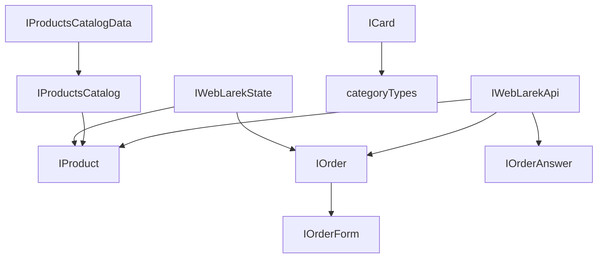

# Проектная работа "Веб-ларек"

Стек: HTML, SCSS, TS, Webpack

Структура проекта:

- src/ — исходные файлы проекта
- src/components/ — папка с JS компонентами
- src/components/base/ — папка с базовым кодом

Важные файлы:

- src/pages/index.html — HTML-файл главной страницы
- src/types/index.ts — файл с типами
- src/index.ts — точка входа приложения
- src/scss/styles.scss — корневой файл стилей
- src/utils/constants.ts — файл с константами
- src/utils/utils.ts — файл с утилитами

## Установка и запуск

Для установки и запуска проекта необходимо выполнить команды

```shell
npm install
npm run start
```

или

```shell
yarn
yarn start
```

## Сборка

```shell
npm run build
```

или

```shell
yarn build
```

## Архитектура приложения

Для реализации приложения выбран паттерн MVP c использованием брокера событий. В этом подходе, MVP обеспечивает структуру для разделения ответственности между представлением (View), моделью (Model) и презентатором (Presenter), а брокер событий позволяет компонентам взаимодействовать асинхронно, используя события.

Модель приложения реализована классом `WebLarek` с интерфейсом `IWebLarekState` c использованием базового класса `Model`.

За отображение интерфесвов и взаимодействие с пользователем отвечают классы представления `Page`, `Card`, `Basket`, `Success`, `Order`, `Contacts`. Для отображения форм используется базовый дженерик класс `Form<T>`. Для отображения всех модальных окон используется базовый класс `Modal`. В качестве базового класса для работы с DOM-элементами веб-страниц используется класс `Component<T>` предоставленный в стартовом наборе.

Весь функционал Presenter-а реализован файле - точке входа в приложение `src/index.ts`.

В качестве брокера событий используется класс `EventEmitter` предоставленный в стартовом наборе.

Взаимодействие с серверной частью приложения реализовано за счет расширения базового метода JavaScript `fetch`. Базовый функционал работы с запросами к серверу реализован в классе `Api`, предоставленного в стартовом пакете. Специфический для текущего приложения функционал реализован в классе `WebLarekApi`.

Подробное описание всех классов и презентера ниже.

## Константы и настройки приложения

**Файл:** `src/utils/constants.ts` содержит глобальные константы и настройки приложения, включая:

- URL API и CDN
- Текстовые константы для интерфейса
- Настройки валюты
- Классы CSS для категорий товаров

### Константы API

1. **`API_URL`**: Базовый URL для API-запросов. Собирается из переменной окружения `API_ORIGIN` с добавлением пути `/api/weblarek`

```typescript
export const API_URL = `${process.env.API_ORIGIN}/api/weblarek`;
```

2. **`CDN_URL`\***: Базовый URL для доступа к контенту (изображениям, медиа). Собирается из переменной окружения `API_ORIGIN` с добавлением пути `/content/weblarek`

```typescript
export const CDN_URL = `${process.env.API_ORIGIN}/content/weblarek`;
```

### Объект настроек `settings`

1. **`currency`**: название валюты приложения в родительном падеже.
   _Использование_: Для отображения в интерфейсе (например, "Списано 100 синапсов")

2. **`messages`**: тексты используемые в интерфейсе приложения

   2.1. **`formErrors`**: сообщения об ошибках валидации для различных полей формы

   ```typescript
   phone: 'Необходимо указать телефон',
   email: 'Необходимо указать email',
   address: 'Необходимо указать адрес доставки',
   payment: 'Необходимо выбрать способ оплаты',
   ```

   2.2. **`card`**: тексты в карточке товаров

   ```typescript
   noprice: 'Бесценно'; // замена для цены 0.
   ```

   2.3. **`buyButtonValues`**: тексты для кнопки покупки в разных состояниях

   ```typescript
   add: 'Купить',
   delete: 'Убрать',
   disabled: 'Недоступно',
   ```

   2.4. **`success`**: шаблон сообщения об успешном заказе. _Примечание_: `summa` будет заменено на фактическую сумму.

   ```typescript
   success: 'Списано summa синапсов';
   ```

   2.5. **`basket`**: тексты в окне корзины

   ```typescript
   empty: 'Корзина пуста'; // сообщение при пустой корзине вместо списка продуктов
   ```

3. **`categoryClasses`**: маппинг названий категорий на CSS-классы для стилизации, где

- Ключ: название категории из API
- Значение: соответствующий CSS-класс

```typescript
'другое': 'card__category_other',
'софт-скил': 'card__category_soft',
'дополнительное': 'card__category_additional',
'кнопка': 'card__category_button',
'хард-скил': 'card__category_hard',
```

### Особенности

- Все текстовые константы собраны в одном месте для удобства локализации
- Настройки стилей категорий централизованы для согласованности интерфейса
- URL API и CDN конфигурируются через переменные окружения

## Ключевые типы данных

**Файл**: `src/types/index.ts` содержит все основные типы данных и интерфейсы, используемые в приложении. Разделен на три основные категории:

1. Модельные типы (Model) - описывают структуру данных приложения
2. Типы представления (View) - описывают структуры для работы с UI
3. API типы - описывают структуры для работы с API

### Модельные типы (Model)

1. **IProduct`**: описывает структуру данных продукта.

```typescript
export interface IProduct {
	id: string; // уникальный идентификатор
	title: string; // название продукта
	category: string; // категория продукта
	description: string; // описание продукта
	image: string; // путь к изображению
	price: number; // цена продукта
}
```

2. **`IProductsCatalog`**: описывает каталог продуктов как массив `IProduct`

```typescript
export interface IProductsCatalog {
	items: IProduct[];
}
```

3. **`IWebLarekState`**: главный интерфейс состояния приложения

```typescript
export interface IWebLarekState {
	catalog: IProduct[]; // массив продуктов, с которым работает приложение
	preview: string | null; // id продукта для просмотра в модальном окне
	order: IOrder | null; // данные текущего заказа: корзина + данные клиента
	formErrors: FormErrors; // ошибки валидации форм
	setProducts(items: IProduct[]): void; // сохранить данные каталога полученные из api
	getProduct(id: string): IProduct; // возвращает данные конкретного продукта
	addToBasket(id: string): void; // добавить продукт в корзину
	deleteFromBasket(id: string): void; // удалить продукт из корзины
	inBasket(id: string): boolean; // проверить наличие продукта в корзине
	getProductsInBasketCount(): number; // посчитать количество продуктов в корзине
	getTotal(): number; // посчитать общую стоимость продуктов корзины/заказа
	clearBasket(): void; // очистить корзину/заказ после успешной отправки на сервер
	setOrderField(field: keyof IOrderForm, value: string): void; // заполнение полей заказа из формы выбора типа оплаты и ввода адреса доставки
	setContactsField(field: keyof IOrderForm, value: string): void; // заполнение полей заказа из формы ввода номера телефон и email-a
	validateOrder(): void; // проврека формы выбора типа оплаты и ввода адреса доставки
	validateContacts(): void; // проврека формы выбора ввода номера телефон и email-a
	setPreview(item: IProduct): void; // установить id выбранного к просмотру в модальном окне продукта
}
```

4. **`IOrderForm`**: данные формы заказа, вводимые пользователем

```typescript
export interface IOrderForm {
	payment: string;
	email: string;
	phone: string;
	address: string;
}
```

5. **`IOrder`**: полные данные заказа, включая продукты и итоговую сумму

```typescript
export interface IOrder extends IOrderForm {
	items: string[];
	total: number;
}
```

6. **`FormErrors`**: тип для ошибок валидации формы заказа

```typescript
export type FormErrors = Partial<Record<keyof IOrder, string>>;
```

## Типы представления (View)

1. **`IPage`**: описывает состояние страницы

```typescript
export interface IPage {
	products: HTMLElement[]; // массив HTML-элементов карточек товаров
	locked: boolean; // флаг блокировки страницы при открытом модальном окне
	counter: number; // счетчик товаров в корзине
}
```

2. **`IBasketView`**: состояние представления корзины

```typescript
export interface IBasketView {
	items: HTMLElement[];
	total: number;
}
```

3. **`ICard`**: описывает карточку товара

```typescript
export interface ICard {
	id: string;
	title: string;
	description?: string;
	image?: string;
	price: number;
	itemIndex: number;
	category?: categoryTypes;
	changeButton(price: number, inBasket: boolean): void; // обновляет состояние кнопки покупки
}
```

4. **`ICardActions`**: действия для карточки товара

```typescript
export interface ICardActions {
	onClick: (event: MouseEvent) => void;
}
```

5. **`ISuccess`** и **`ISuccessActions`**: описывают окно успешного оформления заказа

```typescript
export interface ISuccess {
	total: number;
}

export interface ISuccessActions {
	onClick: () => void;
}
```

6. **`IModalData`**: данные для модального окна

```typescript
export interface IModalData {
	content: HTMLElement;
}
```

7. **`categoryTypes`**: возможные категории товаров

```typescript
export type categoryTypes =
	| 'другое'
	| 'софт-скил'
	| 'дополнительное'
	| 'кнопка'
	| 'хард-скил';
```

## API типы

1. **`IWebLarekApi`**: интерфейс API приложения

```typescript
export interface IWebLarekApi {
	getProducts: () => Promise<IProduct[]>; // получение списка товаров
	getProduct: (id: string) => Promise<IProduct>; // получение конкретного товара
	sendOrder: (data: Partial<IOrder>) => Promise<IOrderAnswer>; // отправка заказа
}
```

2. **`IProductsCatalogData`**: ответ API для каталога товаров с общим количеством

```typescript
export interface IProductsCatalogData extends IProductsCatalog {
	total: number;
}
```

3. **`IOrderAnswer`**: ответ API после оформления заказа

```typescript
export interface IOrderAnswer {
	id: string;
	total: number;
}
```

## Взаимосвязи типов



## Базовый код

1. **Класс `API`**

2. **Класс `Component<T>`**

3. **Класс `EventEmitter`**

Реализует паттерн «Наблюдатель» и позволяет подписываться на события и уведомлять подписчиков о наступлении события.

Класс имеет методы `on`, `off`, `emit` — для подписки на событие, отписки от события и уведомления подписчиков о наступлении события соответственно.

Дополнительно реализованы методы `onAll` и `offAll` — для подписки на все события и сброса всех подписчиков.

Интересным дополнением является метод `trigger`, генерирующий заданное событие с заданными аргументами. Это позволяет передавать его в качестве обработчика события в другие классы. Эти классы будут генерировать события, не будучи при этом напрямую зависимыми от класса `EventEmitter`.

4. **`Model<T>`**

## Модель данных (бизнес-логика)

### Класс WebLarek

Класс `WebLarek` содержит состояние всего приложения и управляет этим состоянием. Класс управляет каталогом товаров, корзиной покупок и процессом оформления заказа.

```typescript
export class WebLarek extends Model<IWebLarekState>
```

Класс наследуется от базового класса `Model` с указанием типа состояния `IWebLarekState`.

#### Свойства

1. `catalog: IProduct[]`
   Массив товаров каталога магазина.

2. `order: IOrder`
   Объект, содержащий информацию о текущем заказе:

- `email`: string - email покупателя
- `phone`: string - телефон покупателя
- `payment`: string - способ оплаты
- `address`: string - адрес доставки
- `items`: string[] - массив идентификаторов товаров в корзине
- `total`: number - общая сумма заказа

3. `preview: string | null`
   Идентификатор товара, который в данный момент просматривается в модальном окне (или null, если ничего не просматривается).

4. `formErrors: FormErrors`
   Объект, содержащий ошибки валидации форм.

#### Методы

1. `setProducts(items: IProduct[]): void`
   Сохраняет данные каталога, полученные из API.

- `items` - массив товаров
- Генерирует событие `'products:changed'`

2. `getProduct(id: string): IProduct`
   Возвращает данные конкретного товара по его идентификатору.

- `id` - идентификатор товара
- Возвращает объект товара или undefined, если товар не найден

3. `addToBasket(id: string): void`
   Добавляет товар в корзину.

- `id` - идентификатор товара
- Обновляет общую сумму заказа
- Генерирует событие `'products:changed'`

4. `deleteFromBasket(id: string): void`
   Удаляет товар из корзины.

- `id` - идентификатор товара
- Обновляет общую сумму заказа
- Генерирует событие `'products:changed'`

5. `inBasket(id: string): boolean`
   Проверяет наличие товара в корзине.

- `id` - идентификатор товара
- Возвращает `true`, если товар есть в корзине, иначе `false`

6. `getProductsInBasketCount(): number`
   Возвращает количество товаров в корзине.

7. `getTotal(): number`
   Вычисляет общую стоимость товаров в корзине.

8. `clearBasket(): void`
   Очищает корзину после успешного оформления заказа.

- Сбрасывает все поля заказа
- Генерирует событие `'products:changed'`

9. `setOrderField(field: keyof IOrderForm, value: string): void`
   Устанавливает значение поля заказа (шаг 1 оформления).

- `field` - название поля ('payment' или 'address')
- `value` - значение поля
- Вызывает валидацию формы заказа

10. `setContactsField(field: keyof IOrderForm, value: string): void`
    Устанавливает значение поля контактов (шаг 2 оформления).

- `field` - название поля ('email' или 'phone')
- `value` - значение поля
- Вызывает валидацию формы контактов

11. `validateOrder(): void`
    Проверяет валидность данных заказа (шаг 1).

- Устанавливает ошибки в `formErrors`
- Генерирует событие `'orderFormErrors:change'` с текущими ошибками

12. `validateContacts(): void`
    Проверяет валидность контактных данных (шаг 2).

- Устанавливает ошибки в `formErrors`
- Генерирует событие `'contactsFormErrors:change'` с текущими ошибками

13. `setPreview(item: IProduct): void`
    Устанавливает товар для просмотра в модальном окне.

- `item` - объект товара
- Устанавливает `preview` в ID товара
- Генерирует событие `'preview:changed'` с данными товара

#### Использование событий

Класс генерирует следующие события:

- `'products:changed'` - при изменении каталога или корзины
- `'orderFormErrors:change'` - при изменении ошибок формы заказа
- `'contactsFormErrors:change'` - при изменении ошибок формы контактов
- `'preview:changed'` - при изменении просматриваемого товара

## Компоненты представления

1. Класс Page

2. Класс Modal

3. Класс Form<T>

4. Класс Order

5. Класс Contacts

6. Класс Card

7. Класс Basket

8. Класс Success

## Презентер `src/index.ts`

## Компоненты работы с API

1. Класс WebLarekApi

## Размещение в сети

Рабочая версия проекта доступна по адресу:
