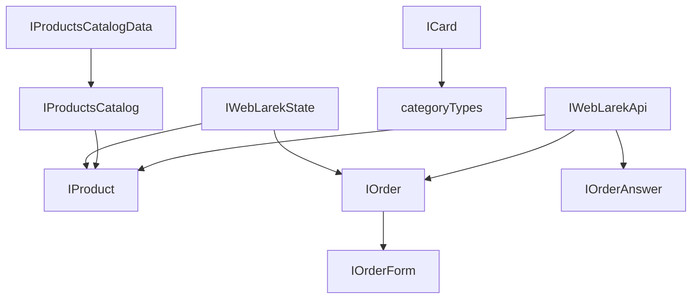

# Проектная работа "Веб-ларек"

Стек: HTML, SCSS, TS, Webpack

Структура проекта:

- src/ — исходные файлы проекта
- src/components/ — папка с JS компонентами
- src/components/base/ — папка с базовым кодом

Важные файлы:

- src/pages/index.html — HTML-файл главной страницы
- src/types/index.ts — файл с типами
- src/index.ts — точка входа приложения
- src/scss/styles.scss — корневой файл стилей
- src/utils/constants.ts — файл с константами
- src/utils/utils.ts — файл с утилитами

## Установка и запуск

Для установки и запуска проекта необходимо выполнить команды

```shell
npm install
npm run start
```

или

```shell
yarn
yarn start
```

## Сборка

```shell
npm run build
```

или

```shell
yarn build
```

## Архитектура приложения

Для реализации приложения выбран паттерн MVP c использованием брокера событий. В этом подходе, MVP обеспечивает структуру для разделения ответственности между представлением (View), моделью (Model) и презентатором (Presenter), а брокер событий позволяет компонентам взаимодействовать асинхронно, используя события.

Модель приложения реализована классом `WebLarek` с интерфейсом `IWebLarekState` c использованием базового класса `Model`.

За отображение интерфесвов и взаимодействие с пользователем отвечают классы представления `Page`, `Card`, `Basket`, `Success`, `Order`, `Contacts`. Для отображения форм используется базовый дженерик класс `Form<T>`. Для отображения всех модальных окон используется базовый класс `Modal`. В качестве базового класса для работы с DOM-элементами веб-страниц используется класс `Component<T>` предоставленный в стартовом наборе.

Весь функционал Presenter-а реализован файле - точке входа в приложение `src/index.ts`.

В качестве брокера событий используется класс `EventEmitter` предоставленный в стартовом наборе.

Взаимодействие с серверной частью приложения реализовано за счет расширения базового метода JavaScript `fetch`. Базовый функционал работы с запросами к серверу реализован в классе `Api`, предоставленного в стартовом пакете. Специфический для текущего приложения функционал реализован в классе `WebLarekApi`.

## Константы и настройки приложения

**Файл:** `src/utils/constants.ts` содержит глобальные константы и настройки приложения, включая:

- URL API и CDN
- Текстовые константы для интерфейса
- Настройки валюты
- Классы CSS для категорий товаров

### Константы API

1. **`API_URL`**: Базовый URL для API-запросов. Собирается из переменной окружения `API_ORIGIN` с добавлением пути `/api/weblarek`

```typescript
export const API_URL = `${process.env.API_ORIGIN}/api/weblarek`;
```

2. **`CDN_URL`\***: Базовый URL для доступа к контенту (изображениям, медиа). Собирается из переменной окружения `API_ORIGIN` с добавлением пути `/content/weblarek`

```typescript
export const CDN_URL = `${process.env.API_ORIGIN}/content/weblarek`;
```

### Объект настроек `settings`

1. **`currency`**: название валюты приложения в родительном падеже.
   _Использование_: Для отображения в интерфейсе (например, "Списано 100 синапсов")

2. **`messages`**: тексты используемые в интерфейсе приложения

   2.1. **`formErrors`**: сообщения об ошибках валидации для различных полей формы

   ```typescript
   phone: 'Необходимо указать телефон',
   email: 'Необходимо указать email',
   address: 'Необходимо указать адрес доставки',
   payment: 'Необходимо выбрать способ оплаты',
   ```

   2.2. **`card`**: тексты в карточке товаров

   ```typescript
   noprice: 'Бесценно'; // замена для цены 0.
   ```

   2.3. **`buyButtonValues`**: тексты для кнопки покупки в разных состояниях

   ```typescript
   add: 'Купить',
   delete: 'Убрать',
   disabled: 'Недоступно',
   ```

   2.4. **`success`**: шаблон сообщения об успешном заказе. _Примечание_: `summa` будет заменено на фактическую сумму.

   ```typescript
   success: 'Списано summa синапсов';
   ```

   2.5. **`basket`**: тексты в окне корзины

   ```typescript
   empty: 'Корзина пуста'; // сообщение при пустой корзине вместо списка продуктов
   ```

3. **`categoryClasses`**: маппинг названий категорий на CSS-классы для стилизации, где

- Ключ: название категории из API
- Значение: соответствующий CSS-класс

```typescript
'другое': 'card__category_other',
'софт-скил': 'card__category_soft',
'дополнительное': 'card__category_additional',
'кнопка': 'card__category_button',
'хард-скил': 'card__category_hard',
```

### Особенности

- Все текстовые константы собраны в одном месте для удобства локализации
- Настройки стилей категорий централизованы для согласованности интерфейса
- URL API и CDN конфигурируются через переменные окружения

## Ключевые типы данных

**Файл**: `src/types/index.ts` содержит все основные типы данных и интерфейсы, используемые в приложении. Разделен на три основные категории:

1. Модельные типы (Model) - описывают структуру данных приложения
2. Типы представления (View) - описывают структуры для работы с UI
3. API типы - описывают структуры для работы с API

### Модельные типы (Model)

1. **IProduct`**: описывает структуру данных продукта.

```typescript
export interface IProduct {
	id: string; // уникальный идентификатор
	title: string; // название продукта
	category: string; // категория продукта
	description: string; // описание продукта
	image: string; // путь к изображению
	price: number; // цена продукта
}
```

2. **`IProductsCatalog`**: описывает каталог продуктов как массив `IProduct`

```typescript
export interface IProductsCatalog {
	items: IProduct[];
}
```

3. **`IWebLarekState`**: главный интерфейс состояния приложения

```typescript
export interface IWebLarekState {
	// массив продуктов, с которым работает приложение
	catalog: IProduct[];
	// id продукта для просмотра в модальном окне
	preview: string | null;
	// данные текущего заказа: корзина + данные клиента
	order: IOrder | null;
	// ошибки валидации форм
	formErrors: FormErrors;

	// сохранить данные каталога полученные из api
	setProducts(items: IProduct[]): void;
	// возвращает данные конкретного продукта
	getProduct(id: string): IProduct;
	// добавить продукт в корзину
	addToBasket(id: string): void;
	// удалить продукт из корзины
	deleteFromBasket(id: string): void;
	// проверить наличие продукта в корзине
	inBasket(id: string): boolean;
	// посчитать количество продуктов в корзине
	getProductsInBasketCount(): number;
	// посчитать общую стоимость продуктов корзины/заказа
	getTotal(): number;
	// очистить корзину/заказ после успешной отправки на сервер
	clearBasket(): void;
	// заполнение полей заказа из формы выбора типа оплаты и ввода адреса доставки
	setOrderField(field: keyof IOrderForm, value: string): void;
	// заполнение полей заказа из формы ввода номера телефон и email-a
	setContactsField(field: keyof IOrderForm, value: string): void;
	// проврека формы выбора типа оплаты и ввода адреса доставки
	validateOrder(): void;
	// проврека формы выбора ввода номера телефон и email-a
	validateContacts(): void;
	// установить id выбранного к просмотру в модальном окне продукта
	setPreview(item: IProduct): void;
}
```

4. **`IOrderForm`**: данные формы заказа, вводимые пользователем

```typescript
export interface IOrderForm {
	payment: string;
	email: string;
	phone: string;
	address: string;
}
```

5. **`IOrder`**: полные данные заказа, включая продукты и итоговую сумму

```typescript
export interface IOrder extends IOrderForm {
	items: string[];
	total: number;
}
```

6. **`FormErrors`**: тип для ошибок валидации формы заказа

```typescript
export type FormErrors = Partial<Record<keyof IOrder, string>>;
```

### Типы представления (View)

1. **`IPage`**: описывает состояние страницы

```typescript
export interface IPage {
	products: HTMLElement[]; // массив HTML-элементов карточек товаров
	locked: boolean; // флаг блокировки страницы при открытом модальном окне
	counter: number; // счетчик товаров в корзине
}
```

2. **`IBasketView`**: состояние представления корзины

```typescript
export interface IBasketView {
	items: HTMLElement[];
	total: number;
}
```

3. **`ICard`**: описывает карточку товара

```typescript
export interface ICard {
	id: string;
	title: string;
	description?: string;
	image?: string;
	price: number;
	itemIndex: number;
	category?: categoryTypes;
	changeButton(price: number, inBasket: boolean): void; // обновляет состояние кнопки покупки
}
```

4. **`ICardActions`**: действия для карточки товара

```typescript
export interface ICardActions {
	onClick: (event: MouseEvent) => void;
}
```

5. **`ISuccess`** и **`ISuccessActions`**: описывают окно успешного оформления заказа

```typescript
export interface ISuccess {
	total: number;
}

export interface ISuccessActions {
	onClick: () => void;
}
```

6. **`IModalData`**: данные для модального окна

```typescript
export interface IModalData {
	content: HTMLElement;
}
```

7. **`categoryTypes`**: возможные категории товаров

```typescript
export type categoryTypes =
	| 'другое'
	| 'софт-скил'
	| 'дополнительное'
	| 'кнопка'
	| 'хард-скил';
```

### API типы

1. **`IWebLarekApi`**: интерфейс API приложения

```typescript
export interface IWebLarekApi {
	getProducts: () => Promise<IProduct[]>; // получение списка товаров
	getProduct: (id: string) => Promise<IProduct>; // получение конкретного товара
	sendOrder: (data: Partial<IOrder>) => Promise<IOrderAnswer>; // отправка заказа
}
```

2. **`IProductsCatalogData`**: ответ API для каталога товаров с общим количеством

```typescript
export interface IProductsCatalogData extends IProductsCatalog {
	total: number;
}
```

3. **`IOrderAnswer`**: ответ API после оформления заказа

```typescript
export interface IOrderAnswer {
	id: string;
	total: number;
}
```

### Взаимосвязи типов



## Базовый код

### Класс `API`

**Файл**: `src/components/base/api.ts`.

Реализует базовый функционал обмена данными с серверной частью приложения средствами javascript.

Класс имеет методы:

- `get` - выполнение GET-запросов к серверу,
- `post` - выполнение POST, PATCH, DELETE запросов к серверу,
- `handleResponse` - базовая проверка ответа от сервера и привидение его к требуемому типу.

Для начала работы с сервером при инициалищзации экземпляра класса необходимо передать адрес сервера в обязательном параметре `baseUrl` и при необходимости дополнительные парметры в `options`.

### Класс `Component<T>`

**Файл**: `src/components/base/Component.ts`.

Класс содержит базовые методы для работы с любыми HTML-элементами страницы и используется во всех класса представления (View):

1. **Переключить класс**

```typescript
toggleClass(element: HTMLElement, className: string, force?: boolean)
```

2. **Установить текстовое содержимое**

```typescript
setText(element: HTMLElement, value: unknown)
```

3. **Сменить статус блокировки**

```typescript
setDisabled(element: HTMLElement, state: boolean)
```

4. **Скрыть элемент**

```typescript
setHidden(element: HTMLElement)
```

5. **Показать элемент**

```typescript
setVisible(element: HTMLElement)
```

6. **Установить изображение с алтернативным текстом**

```typescript
setImage(element: HTMLImageElement, src: string, alt?: string)
```

7. **Вернуть корневой DOM-элемент**

```typescript
render(data?: Partial<T>): HTMLElement
```

### Класс `EventEmitter`

**Файл**: `src/components/base/event.ts`.

Реализует паттерн «Наблюдатель» и позволяет подписываться на события и уведомлять подписчиков о наступлении события.

Класс имеет методы `on`, `off`, `emit` — для подписки на событие, отписки от события и уведомления подписчиков о наступлении события соответственно.

Дополнительно реализованы методы `onAll` и `offAll` — для подписки на все события и сброса всех подписчиков.

Интересным дополнением является метод `trigger`, генерирующий заданное событие с заданными аргументами. Это позволяет передавать его в качестве обработчика события в другие классы. Эти классы будут генерировать события, не будучи при этом напрямую зависимыми от класса `EventEmitter`.

### `Model<T>`

**Файл**: `src/components/base/Model.ts`.

Базовый абстрактный класс `Model<T>` предоставляет фундаментальную функциональность для работы с моделями данных в TypeScript-приложении. Он служит для:

1. Различения моделей от простых объектов данных
2. Предоставления общего интерфейса для работы с событиями моделей
3. Создания основы для конкретных моделей данных в приложении

Файл содержит Type Guard `isModel`, который проверяет, является ли переданный объект экземпляром класса Model.

```typescript
export const isModel = (obj: unknown): obj is Model<any> => {
	return obj instanceof Model;
};
```

А также сам обстрактный класс с описанным конструктором и одним общим для всех моделей методом `emitChanges`. Реализация класса изначально подразумевает, что модель будет работать с брокером событий.

1. **Конструктор**:

```typescript
constructor(data: Partial<T>, protected events: IEvents)
```

Параметры:

- `data: Partial<T>` - начальные данные для модели (частичные, так как могут быть не все поля)
- `events: IEvents` - объект для работы с событиями.

2. **Метод `emitChanges`**: используется для уведомления подписчиков об изменениях в модели.

```typescript
emitChanges(event: string, payload?: object): void
```

Параметры:

- `event: string` - название события
- `payload?: object` - дополнительные данные события (по умолчанию - пустой объект)

## Модель данных (бизнес-логика)

### Класс WebLarek

**Файл**: `src/components/WebLarekModel.ts`.

Класс `WebLarek` содержит состояние всего приложения и управляет этим состоянием. Класс управляет каталогом товаров, корзиной покупок и процессом оформления заказа.

```typescript
export class WebLarek extends Model<IWebLarekState>
```

Класс наследуется от базового класса `Model` с указанием типа состояния `IWebLarekState`.

#### Свойства

1. `catalog: IProduct[]`
   Массив товаров каталога магазина.

2. `order: IOrder`
   Объект, содержащий информацию о текущем заказе:

- `email`: string - email покупателя
- `phone`: string - телефон покупателя
- `payment`: string - способ оплаты
- `address`: string - адрес доставки
- `items`: string[] - массив идентификаторов товаров в корзине
- `total`: number - общая сумма заказа

3. `preview: string | null`
   Идентификатор товара, который в данный момент просматривается в модальном окне (или null, если ничего не просматривается).

4. `formErrors: FormErrors`
   Объект, содержащий ошибки валидации форм.

#### Методы

1. `setProducts(items: IProduct[]): void`
   Сохраняет данные каталога, полученные из API.

- `items` - массив товаров
- Генерирует событие `'products:changed'`, т.к. после загрузки каталога с сервера необходимо перерисовать главную страницу

2. `getProduct(id: string): IProduct`
   Возвращает данные конкретного товара по его идентификатору.

- `id` - идентификатор товара
- Возвращает объект товара или undefined, если товар не найден

3. `addToBasket(id: string): void`
   Добавляет товар в корзину.

- `id` - идентификатор товара
- Обновляет общую сумму заказа
- Генерирует событие `'products:changed'`, т.к. после добавления продукта в корзину необходимо обновить главную страницу, чтобы иземлось количество продуктов над иконкой корзины.

4. `deleteFromBasket(id: string): void`
   Удаляет товар из корзины.

- `id` - идентификатор товара
- Обновляет общую сумму заказа
- Генерирует событие `'products:changed'`, т.к. после удаления продукта из корзины необходимо обновить главную страницу, чтобы иземлось количество продуктов над иконкой корзины.

5. `inBasket(id: string): boolean`
   Проверяет наличие товара в корзине.

- `id` - идентификатор товара
- Возвращает `true`, если товар есть в корзине, иначе `false`

6. `getProductsInBasketCount(): number`
   Возвращает количество товаров в корзине.

7. `getTotal(): number`
   Вычисляет общую стоимость товаров в корзине.

8. `clearBasket(): void`
   Очищает корзину после успешного оформления заказа.

- Сбрасывает все поля заказа
- Генерирует событие `'products:changed'`, т.к. после очистки корзины необходимо обновить главную страницу, чтобы иземлось количество продуктов над иконкой корзины.

9. `setOrderField(field: keyof IOrderForm, value: string): void`
   Устанавливает значение поля заказа (шаг 1 оформления).

- `field` - название поля ('payment' или 'address')
- `value` - значение поля
- Вызывает валидацию формы заказа

10. `setContactsField(field: keyof IOrderForm, value: string): void`
    Устанавливает значение поля контактов (шаг 2 оформления).

- `field` - название поля ('email' или 'phone')
- `value` - значение поля
- Вызывает валидацию формы контактов

11. `validateOrder(): void`
    Проверяет валидность формы выбора способа оплаты и ввода адреса доставки.

- Устанавливает ошибки в `formErrors`
- Генерирует событие `'orderFormErrors:change'` с текущими ошибками, чтобы отобразить их в форме.

12. `validateContacts(): void`
    Проверяет валидность формы ввода контактных данных.

- Устанавливает ошибки в `formErrors`
- Генерирует событие `'contactsFormErrors:change'` с текущими ошибками, чтобы отобразить их в форме.

13. `setPreview(item: IProduct): void`
    Устанавливает продукт для просмотра в модальном окне.

- `item` - объект товара
- Устанавливает `preview` в ID товара
- Генерирует событие `'preview:changed'` с данными продукта, чтобы открыть окно просмотра продукта.

## Компоненты представления

Все методы работы с HTML-элементами веб-страницы реализованы в базовом классе `Component`.

Поэтому все классы представления описанные ниже по сути реализрована по одной и той же схеме:

1. в конструкторе класса по идентификатору или css-классу находятся объекты веб-страницы, за отображение которых отвечает данный класс.
2. также в конструкторе назначаются необходимые слушатели событий.
3. измения данных в HTML-элемнтах реализованы через соответсвующие сеттеры.

### Класс `Page`

**Файл**: `src/components/Page.ts`.

Класс `Page` представляет собой компонент для управления основным отображением страницы приложения. Наследуется от базового класса `Component` и реализует интерфейс `IPage`.

#### Обрабатываемые элементы (свойства класса)

Класс работает со следующими элементами страницы:

- **\_counter**: HTMLElement - элемент для отображения количества товаров в корзине
- **\_catalog**: HTMLElement - контейнер для элементов каталога
- **\_wrapper**: HTMLElement - обертка страницы (используется для блокировки прокрутки)
- **\_basket**: HTMLElement - кнопка/иконка корзины

#### Методы класса

Для изменения данных элемнтов реализованы следующие методы (сеттеры):

1. **counter**: устанавливает значение счетчика товаров в корзине.

```typescript
set counter(value: number): void
```

Параметры:

- `value: number` - новое значение счетчика

2. **catalog**: обновляет содержимое каталога.

```typescript
set catalog(items: HTMLElement[]): void
```

Параметры:

- `items: HTMLElement[]` - массив DOM-элементов для отображения в каталоге

3. **locked**: блокирует или разблокирует прокрутку страницы.

```typescript
set locked(value: boolean): void
```

Параметры:

- `value: boolean` - флаг блокировки (true - заблокировать, false - разблокировать)

#### Устанавливаемые слушатели событий

При создании экземпляра класса на элемент `_basket` добавляется обработчик клика, который инициирует событие `'basket:open'` через систему событий.

### Класс `Modal`

**Файл**: `src/components/Modal.ts`.

### Класс `Form<T>`

**Файл**: `src/components/Form.ts`.

### Классы `Order` и `Contacts`

**Файл**: `src/components/Order.ts`.

### Класс `Card`

**Файл**: `src/components/Card.ts`.

### Класс `Basket`

**Файл**: `src/components/Basket.ts`.

### Класс `Success`

**Файл**: `src/components/Success.ts`.

## Презентер

**Файл**: `src/index.ts`.

## Компоненты работы с API

### Класс `WebLarekApi`

**Файл**: `src/components/WebLarekApi.ts`.

## Размещение в сети

Рабочая версия проекта доступна по адресу:
